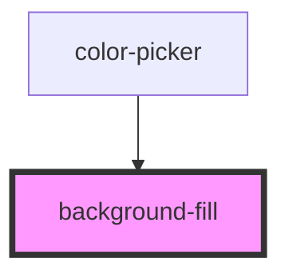

# background-fill

<!-- Auto Generated Below -->

## Properties

| Property         | Attribute        | Description | Type                | Default           |
| ---------------- | ---------------- | ----------- | ------------------- | ----------------- |
| `color`          | `color`          |             | `string`            | `defaultColor`    |
| `image`          | `image`          |             | `string`            | `''`              |
| `line`           | `line`           |             | `string`            | `defaultPosition` |
| `lineargradient` | `lineargradient` |             | `string`            | `''`              |
| `positionx`      | `positionx`      |             | `string`            | `defaultPosition` |
| `positiony`      | `positiony`      |             | `string`            | `defaultPosition` |
| `radialgradient` | `radialgradient` |             | `string`            | `''`              |
| `repeat`         | `repeat`         |             | `boolean \| string` | `defaultRepeat`   |
| `sizex`          | `sizex`          |             | `string`            | `defaultSize`     |
| `sizey`          | `sizey`          |             | `string`            | `defaultSize`     |

## Events

| Event              | Description | Type               |
| ------------------ | ----------- | ------------------ |
| `backgroundchange` |             | `CustomEvent<any>` |

## Dependencies

### Used by

 - [color-picker](../color-picker)

### Graph

----------------------------------------------

*Built with [StencilJS](https://stenciljs.com/)*
