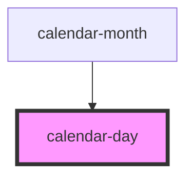

# calendar-day

<!-- Auto Generated Below -->

## Properties

| Property    | Attribute   | Description | Type      | Default      |
| ----------- | ----------- | ----------- | --------- | ------------ |
| `active`    | `active`    | PROPERTIES  | `boolean` | `false`      |
| `clickable` | `clickable` |             | `boolean` | `true`       |
| `date`      | --          |             | `Date`    | `new Date()` |
| `disabled`  | `disabled`  |             | `boolean` | `false`      |

## Events

| Event      | Description | Type               |
| ---------- | ----------- | ------------------ |
| `dayclick` | EVENTS      | `CustomEvent<any>` |

## Methods

### `day(val: any) => Promise<unknown>`

METHODS

#### Returns

Type: `Promise<unknown>`

### `month(val: any) => Promise<unknown>`

#### Returns

Type: `Promise<unknown>`

### `year(val: any) => Promise<unknown>`

#### Returns

Type: `Promise<unknown>`

## Dependencies

### Used by

 - [calendar-month](../calendar-month)

### Graph

----------------------------------------------

*Built with [StencilJS](https://stenciljs.com/)*
