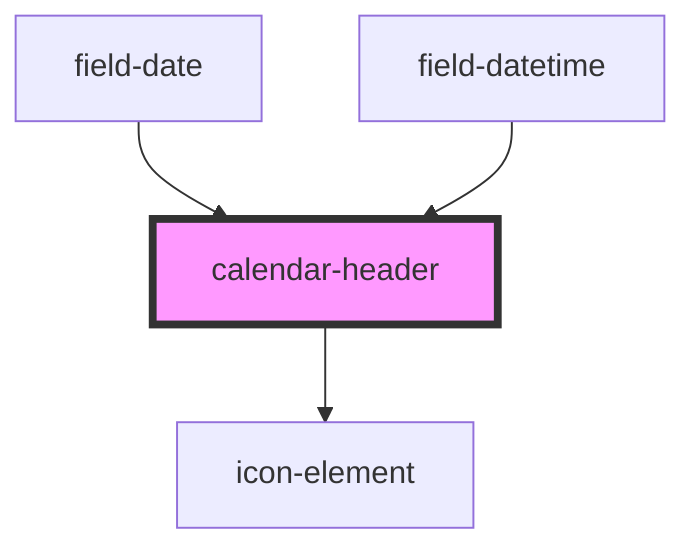

# calendar-header

<!-- Auto Generated Below -->

## Properties

| Property | Attribute | Description | Type             | Default      |
| -------- | --------- | ----------- | ---------------- | ------------ |
| `date`   | `date`    | PROPS       | `Date \| string` | `new Date()` |

## Events

| Event        | Description | Type               |
| ------------ | ----------- | ------------------ |
| `datechange` |             | `CustomEvent<any>` |

## Dependencies

### Used by

 - [field-date](../field-date)
 - [field-datetime](../field-datetime)

### Depends on

- [icon-element](../icon-element)

### Graph

----------------------------------------------

*Built with [StencilJS](https://stenciljs.com/)*
