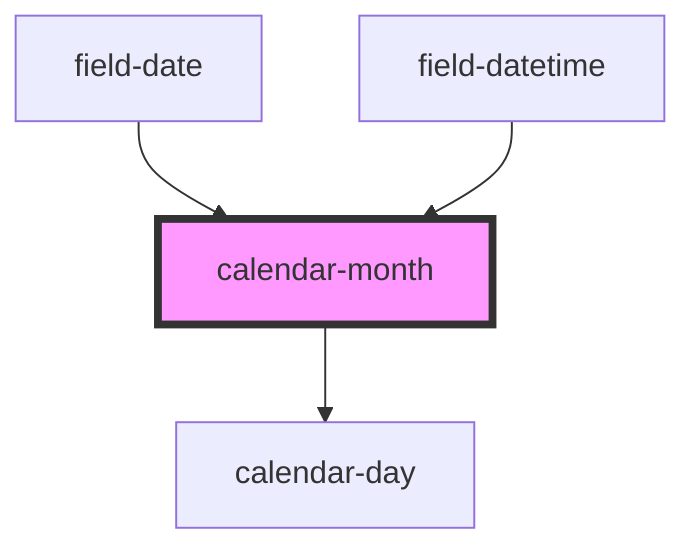

# calendar-month

<!-- Auto Generated Below -->

## Properties

| Property    | Attribute   | Description | Type             | Default               |
| ----------- | ----------- | ----------- | ---------------- | --------------------- |
| `active`    | `active`    | PROPERTIES  | `boolean`        | `false`               |
| `clickable` | `clickable` |             | `boolean`        | `true`                |
| `date`      | `date`      |             | `Date \| string` | `getDate(new Date())` |
| `disabled`  | `disabled`  |             | `boolean`        | `false`               |

## Methods

### `day(val: any) => Promise<unknown>`

METHODS

#### Returns

Type: `Promise<unknown>`

### `month(val: any) => Promise<unknown>`

#### Returns

Type: `Promise<unknown>`

### `year(val: any) => Promise<unknown>`

#### Returns

Type: `Promise<unknown>`

## Dependencies

### Used by

 - [field-date](../field-date)
 - [field-datetime](../field-datetime)

### Depends on

- [calendar-day](../calendar-day)

### Graph

----------------------------------------------

*Built with [StencilJS](https://stenciljs.com/)*
