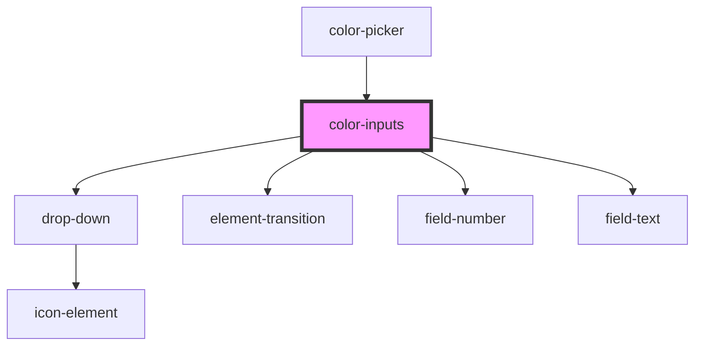

# color-inputs

<!-- Auto Generated Below -->

## Properties

| Property | Attribute | Description | Type                | Default                         |
| -------- | --------- | ----------- | ------------------- | ------------------------------- |
| `color`  | --        |             | `() => ColorResult` | `() => ColorObject(this.value)` |
| `value`  | `value`   |             | `string`            | `defaultColor`                  |

## Events

| Event                    | Description | Type               |
| ------------------------ | ----------- | ------------------ |
| `colorinputschanged`     |             | `CustomEvent<any>` |
| `colorinputsmodechanged` |             | `CustomEvent<any>` |

## Dependencies

### Used by

 - [color-picker](../color-picker)

### Depends on

- [drop-down](../drop-down)
- [element-transition](../element-transition)
- [field-number](../field-number)
- [field-text](../field-text)

### Graph

----------------------------------------------

*Built with [StencilJS](https://stenciljs.com/)*
