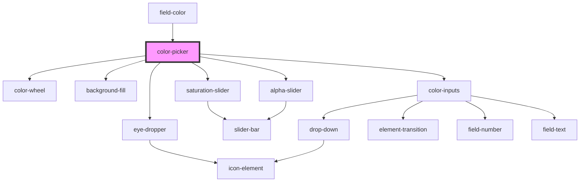

# color-picker

<!-- Auto Generated Below -->

## Properties

| Property | Attribute | Description | Type                | Default                         |
| -------- | --------- | ----------- | ------------------- | ------------------------------- |
| `color`  | --        |             | `() => ColorResult` | `() => ColorObject(this.value)` |
| `value`  | `value`   |             | `string`            | `''`                            |

## Events

| Event                | Description | Type               |
| -------------------- | ----------- | ------------------ |
| `colorpickerchanged` |             | `CustomEvent<any>` |

## Dependencies

### Used by

 - [field-color](../field-color)

### Depends on

- [color-wheel](../color-wheel)
- [background-fill](../background-fill)
- [eye-dropper](../eye-dropper)
- [saturation-slider](../saturation-slider)
- [alpha-slider](../alpha-slider)
- [color-inputs](../color-inputs)

### Graph

----------------------------------------------

*Built with [StencilJS](https://stenciljs.com/)*
