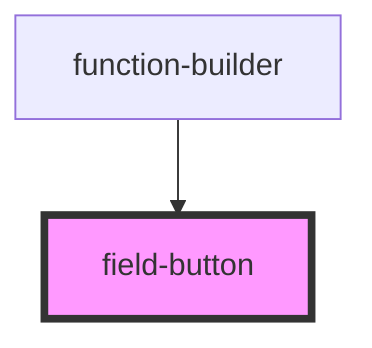

# field-button

<!-- Auto Generated Below -->

## Properties

| Property   | Attribute  | Description | Type      | Default |
| ---------- | ---------- | ----------- | --------- | ------- |
| `disabled` | `disabled` |             | `boolean` | `false` |
| `kind`     | `kind`     |             | `string`  | `''`    |
| `nomargin` | `nomargin` |             | `boolean` | `false` |
| `size`     | `size`     |             | `string`  | `''`    |
| `spinner`  | `spinner`  |             | `boolean` | `false` |
| `theme`    | `theme`    |             | `string`  | `''`    |
| `type`     | `type`     | PROPS       | `string`  | `''`    |

## Dependencies

### Used by

 - [function-builder](../function-builder)

### Graph

----------------------------------------------

*Built with [StencilJS](https://stenciljs.com/)*
