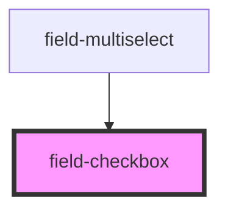

# field-checkbox

<!-- Auto Generated Below -->

## Properties

| Property     | Attribute    | Description | Type              | Default     |
| ------------ | ------------ | ----------- | ----------------- | ----------- |
| `autofocus`  | `autofocus`  | PROPS       | `boolean`         | `false`     |
| `autowidth`  | `autowidth`  |             | `boolean`         | `false`     |
| `disabled`   | `disabled`   |             | `boolean`         | `false`     |
| `error`      | `error`      |             | `string`          | `''`        |
| `helptext`   | `helptext`   |             | `string`          | `undefined` |
| `inputid`    | `inputid`    |             | `string`          | `ID()`      |
| `label`      | `label`      |             | `string`          | `''`        |
| `mixed`      | `mixed`      |             | `boolean`         | `false`     |
| `name`       | `name`       |             | `string`          | `''`        |
| `nomargin`   | `nomargin`   |             | `boolean`         | `false`     |
| `novalidate` | `novalidate` |             | `boolean`         | `false`     |
| `required`   | `required`   |             | `boolean`         | `false`     |
| `theme`      | `theme`      |             | `"" \| "inverse"` | `''`        |
| `value`      | `value`      |             | `boolean`         | `false`     |

## Events

| Event     | Description | Type               |
| --------- | ----------- | ------------------ |
| `changed` |             | `CustomEvent<any>` |

## Methods

### `getValidationMessage() => Promise<string>`

#### Returns

Type: `Promise<string>`

### `getValidity() => Promise<ValidityState>`

METHODS

#### Returns

Type: `Promise<ValidityState>`

## Dependencies

### Used by

 - [field-multiselect](../field-multiselect)

### Graph

----------------------------------------------

*Built with [StencilJS](https://stenciljs.com/)*
