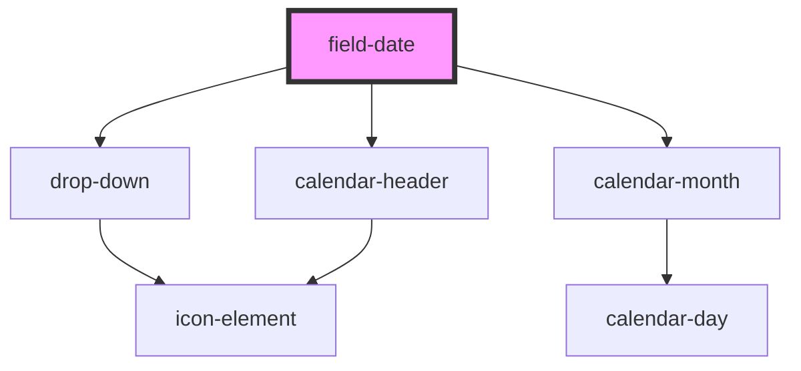

# field-date

<!-- Auto Generated Below -->

## Properties

| Property       | Attribute      | Description | Type              | Default     |
| -------------- | -------------- | ----------- | ----------------- | ----------- |
| `active`       | `active`       |             | `boolean`         | `false`     |
| `autocomplete` | `autocomplete` | PROPS       | `string`          | `'on'`      |
| `autofocus`    | `autofocus`    |             | `boolean`         | `false`     |
| `autowidth`    | `autowidth`    |             | `boolean`         | `false`     |
| `disabled`     | `disabled`     |             | `boolean`         | `false`     |
| `error`        | `error`        |             | `string`          | `''`        |
| `helptext`     | `helptext`     |             | `string`          | `undefined` |
| `inputid`      | `inputid`      |             | `string`          | `ID()`      |
| `label`        | `label`        |             | `string`          | `''`        |
| `labelup`      | `labelup`      |             | `boolean`         | `false`     |
| `max`          | `max`          |             | `number`          | `undefined` |
| `min`          | `min`          |             | `number`          | `undefined` |
| `name`         | `name`         |             | `string`          | `''`        |
| `nomargin`     | `nomargin`     |             | `boolean`         | `false`     |
| `required`     | `required`     |             | `boolean`         | `false`     |
| `theme`        | `theme`        |             | `"" \| "inverse"` | `''`        |
| `value`        | `value`        |             | `Date \| string`  | `undefined` |

## Events

| Event     | Description | Type               |
| --------- | ----------- | ------------------ |
| `changed` |             | `CustomEvent<any>` |

## Methods

### `getValidationMessage() => Promise<string>`

#### Returns

Type: `Promise<string>`

### `getValidity() => Promise<ValidityState>`

METHODS

#### Returns

Type: `Promise<ValidityState>`

## Dependencies

### Depends on

- [drop-down](../drop-down)
- [calendar-header](../calendar-header)
- [calendar-month](../calendar-month)

### Graph

----------------------------------------------

*Built with [StencilJS](https://stenciljs.com/)*
