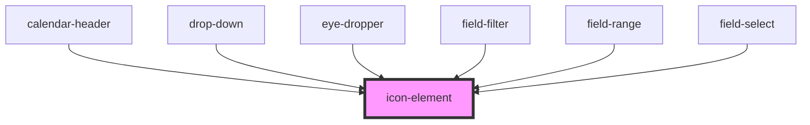

# icon-element

<!-- Auto Generated Below -->

## Properties

| Property | Attribute | Description | Type     | Default |
| -------- | --------- | ----------- | -------- | ------- |
| `kind`   | `kind`    |             | `string` | `''`    |

## Dependencies

### Used by

 - [calendar-header](../calendar-header)
 - [drop-down](../drop-down)
 - [eye-dropper](../eye-dropper)
 - [field-filter](../field-filter)
 - [field-range](../field-range)
 - [field-select](../field-select)

### Graph

----------------------------------------------

*Built with [StencilJS](https://stenciljs.com/)*
