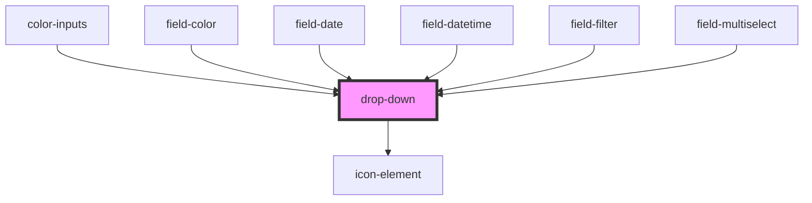

# drop-down

<!-- Auto Generated Below -->

## Properties

| Property       | Attribute      | Description | Type      | Default |
| -------------- | -------------- | ----------- | --------- | ------- |
| `arrow`        | `arrow`        |             | `boolean` | `true`  |
| `closeonclick` | `closeonclick` |             | `boolean` | `true`  |
| `open`         | `open`         |             | `boolean` | `false` |
| `openonhover`  | `openonhover`  |             | `boolean` | `true`  |

## Events

| Event                 | Description | Type               |
| --------------------- | ----------- | ------------------ |
| `dropdownitemclicked` |             | `CustomEvent<any>` |

## Dependencies

### Used by

 - [color-inputs](../color-inputs)
 - [field-color](../field-color)
 - [field-date](../field-date)
 - [field-datetime](../field-datetime)
 - [field-filter](../field-filter)
 - [field-multiselect](../field-multiselect)

### Depends on

- [icon-element](../icon-element)

### Graph

----------------------------------------------

*Built with [StencilJS](https://stenciljs.com/)*
