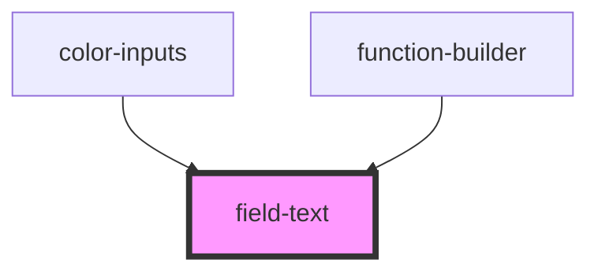

# field-text

<!-- Auto Generated Below -->

## Properties

| Property       | Attribute      | Description | Type              | Default     |
| -------------- | -------------- | ----------- | ----------------- | ----------- |
| `autocomplete` | `autocomplete` | PROPS       | `string`          | `'on'`      |
| `autofocus`    | `autofocus`    |             | `boolean`         | `false`     |
| `autowidth`    | `autowidth`    |             | `boolean`         | `false`     |
| `count`        | `count`        |             | `number`          | `0`         |
| `disabled`     | `disabled`     |             | `boolean`         | `false`     |
| `error`        | `error`        |             | `string`          | `''`        |
| `helptext`     | `helptext`     |             | `string`          | `undefined` |
| `inputid`      | `inputid`      |             | `string`          | `ID()`      |
| `label`        | `label`        |             | `string`          | `''`        |
| `labelup`      | `labelup`      |             | `boolean`         | `false`     |
| `maxlength`    | `maxlength`    |             | `number`          | `undefined` |
| `minlength`    | `minlength`    |             | `number`          | `undefined` |
| `name`         | `name`         |             | `string`          | `''`        |
| `nomargin`     | `nomargin`     |             | `boolean`         | `false`     |
| `required`     | `required`     |             | `boolean`         | `false`     |
| `showcount`    | `showcount`    |             | `boolean`         | `false`     |
| `theme`        | `theme`        |             | `"" \| "inverse"` | `''`        |
| `type`         | `type`         |             | `string`          | `'text'`    |
| `value`        | `value`        |             | `string`          | `''`        |

## Events

| Event     | Description | Type               |
| --------- | ----------- | ------------------ |
| `changed` |             | `CustomEvent<any>` |

## Methods

### `getValidationMessage() => Promise<string>`

#### Returns

Type: `Promise<string>`

### `getValidity() => Promise<ValidityState>`

METHODS

#### Returns

Type: `Promise<ValidityState>`

## Dependencies

### Used by

 - [color-inputs](../color-inputs)
 - [function-builder](../function-builder)

### Graph

----------------------------------------------

*Built with [StencilJS](https://stenciljs.com/)*
