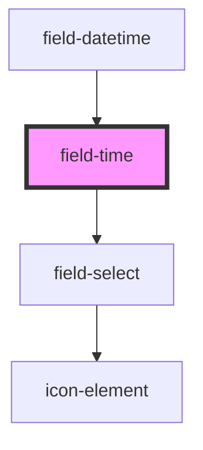

# field-time

<!-- Auto Generated Below -->

## Properties

| Property      | Attribute     | Description | Type              | Default     |
| ------------- | ------------- | ----------- | ----------------- | ----------- |
| `autowidth`   | `autowidth`   | PROPS       | `boolean`         | `false`     |
| `disabled`    | `disabled`    |             | `boolean`         | `false`     |
| `error`       | `error`       |             | `string`          | `''`        |
| `helptext`    | `helptext`    |             | `string`          | `undefined` |
| `inputid`     | `inputid`     |             | `string`          | `ID()`      |
| `label`       | `label`       |             | `string`          | `''`        |
| `labelup`     | `labelup`     |             | `boolean`         | `false`     |
| `max`         | `max`         |             | `string`          | `undefined` |
| `min`         | `min`         |             | `string`          | `undefined` |
| `name`        | `name`        |             | `string`          | `undefined` |
| `nomargin`    | `nomargin`    |             | `boolean`         | `false`     |
| `required`    | `required`    |             | `boolean`         | `false`     |
| `showseconds` | `showseconds` |             | `boolean`         | `false`     |
| `theme`       | `theme`       |             | `"" \| "inverse"` | `''`        |
| `value`       | `value`       |             | `string`          | `''`        |

## Events

| Event         | Description | Type               |
| ------------- | ----------- | ------------------ |
| `changed`     |             | `CustomEvent<any>` |
| `timechange`  |             | `CustomEvent<any>` |
| `valuechange` | EVENTS      | `CustomEvent<any>` |

## Methods

### `getInternal() => Promise<InternalValue>`

#### Returns

Type: `Promise<InternalValue>`

### `getValidationMessage() => Promise<string>`

#### Returns

Type: `Promise<string>`

### `getValidity() => Promise<ValidityState>`

METHODS

#### Returns

Type: `Promise<ValidityState>`

## Dependencies

### Used by

 - [field-datetime](../field-datetime)

### Depends on

- [field-select](../field-select)

### Graph

----------------------------------------------

*Built with [StencilJS](https://stenciljs.com/)*
