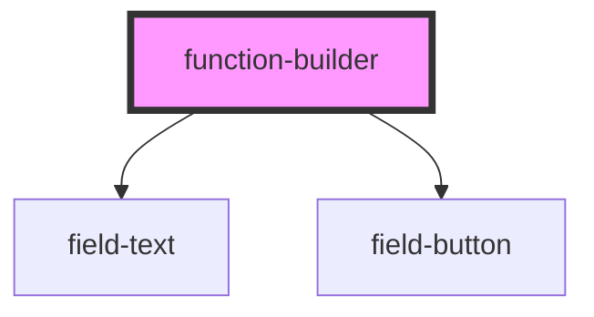

# function-builder

<!-- Auto Generated Below -->

## Properties

| Property  | Attribute | Description | Type     | Default     |
| --------- | --------- | ----------- | -------- | ----------- |
| `context` | `context` | PROPS       | `any`    | `undefined` |
| `value`   | `value`   |             | `string` | `''`        |

## Dependencies

### Depends on

- [field-text](../field-text)
- [field-button](../field-button)

### Graph

----------------------------------------------

*Built with [StencilJS](https://stenciljs.com/)*
