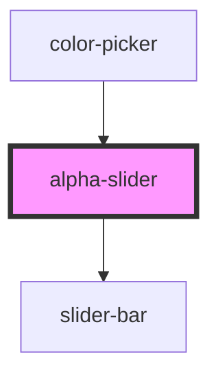

# alpha-slider

<!-- Auto Generated Below -->

## Properties

| Property | Attribute | Description | Type                | Default                                                                                              |
| -------- | --------- | ----------- | ------------------- | ---------------------------------------------------------------------------------------------------- |
| `color`  | --        |             | `() => ColorResult` | `() => ColorObject(`hsla(${this.hue} deg, ${this.saturation}%, ${this.lightness}%, ${this.alpha})`)` |
| `value`  | `value`   |             | `string`            | `''`                                                                                                 |

## Events

| Event              | Description | Type               |
| ------------------ | ----------- | ------------------ |
| `alphasliderinput` |             | `CustomEvent<any>` |

## Dependencies

### Used by

 - [color-picker](../color-picker)

### Depends on

- [slider-bar](../slider-bar)

### Graph

----------------------------------------------

*Built with [StencilJS](https://stenciljs.com/)*
