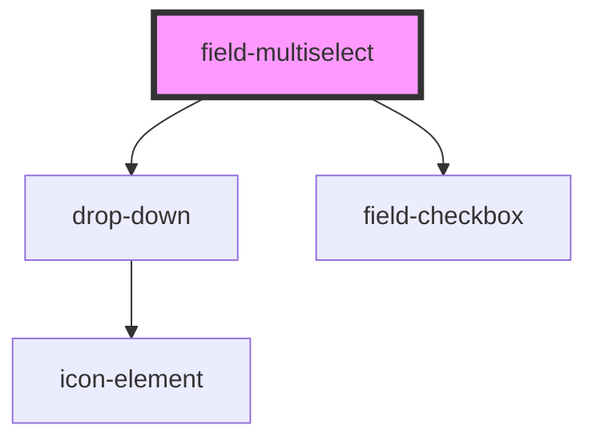

# field-multiselect

<!-- Auto Generated Below -->

## Properties

| Property    | Attribute   | Description | Type              | Default |
| ----------- | ----------- | ----------- | ----------------- | ------- |
| `autofocus` | `autofocus` | PROPS       | `boolean`         | `false` |
| `autowidth` | `autowidth` |             | `boolean`         | `false` |
| `disabled`  | `disabled`  |             | `boolean`         | `false` |
| `error`     | `error`     |             | `string`          | `''`    |
| `helptext`  | `helptext`  |             | `string`          | `''`    |
| `inputid`   | `inputid`   |             | `string`          | `ID()`  |
| `label`     | `label`     |             | `string`          | `''`    |
| `name`      | `name`      |             | `string`          | `''`    |
| `nomargin`  | `nomargin`  |             | `boolean`         | `false` |
| `options`   | `options`   |             | `any[] \| string` | `[]`    |
| `required`  | `required`  |             | `boolean`         | `false` |
| `theme`     | `theme`     |             | `"" \| "inverse"` | `''`    |
| `value`     | --          |             | `any[]`           | `[]`    |

## Events

| Event     | Description | Type               |
| --------- | ----------- | ------------------ |
| `changed` |             | `CustomEvent<any>` |

## Methods

### `getValidationMessage() => Promise<string>`

#### Returns

Type: `Promise<string>`

### `getValidity() => Promise<ValidityState>`

METHODS

#### Returns

Type: `Promise<ValidityState>`

## Dependencies

### Depends on

- [drop-down](../drop-down)
- [field-checkbox](../field-checkbox)

### Graph

----------------------------------------------

*Built with [StencilJS](https://stenciljs.com/)*
