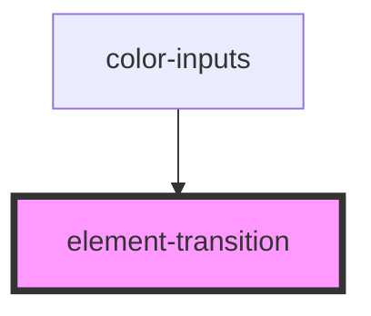

# element-transition

<!-- Auto Generated Below -->

## Properties

| Property         | Attribute        | Description | Type      | Default |
| ---------------- | ---------------- | ----------- | --------- | ------- |
| `removeinactive` | `removeinactive` |             | `boolean` | `false` |
| `speed`          | `speed`          |             | `number`  | `382`   |

## Events

| Event                  | Description | Type               |
| ---------------------- | ----------- | ------------------ |
| `elementtransitioned`  |             | `CustomEvent<any>` |
| `elementtransitioning` |             | `CustomEvent<any>` |

## Methods

### `transition(nextElement: any) => Promise<unknown>`

#### Returns

Type: `Promise<unknown>`

## Dependencies

### Used by

 - [color-inputs](../color-inputs)

### Graph

----------------------------------------------

*Built with [StencilJS](https://stenciljs.com/)*
