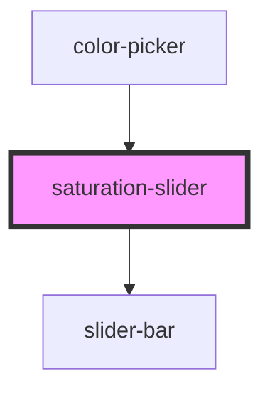

# saturation-slider

<!-- Auto Generated Below -->

## Properties

| Property | Attribute | Description | Type                | Default                         |
| -------- | --------- | ----------- | ------------------- | ------------------------------- |
| `color`  | --        |             | `() => ColorResult` | `() => ColorObject(this.value)` |
| `value`  | `value`   |             | `string`            | `''`                            |

## Events

| Event                   | Description | Type               |
| ----------------------- | ----------- | ------------------ |
| `saturationsliderinput` |             | `CustomEvent<any>` |

## Dependencies

### Used by

 - [color-picker](../color-picker)

### Depends on

- [slider-bar](../slider-bar)

### Graph

----------------------------------------------

*Built with [StencilJS](https://stenciljs.com/)*
