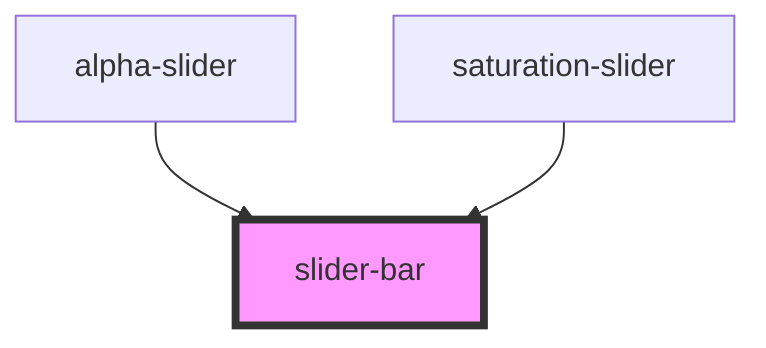

# slider-bar

<!-- Auto Generated Below -->

## Properties

| Property   | Attribute  | Description | Type      | Default     |
| ---------- | ---------- | ----------- | --------- | ----------- |
| `value`    | `value`    |             | `number`  | `0`         |
| `vertical` | `vertical` |             | `boolean` | `undefined` |

## Events

| Event            | Description | Type               |
| ---------------- | ----------- | ------------------ |
| `sliderbarinput` |             | `CustomEvent<any>` |

## Dependencies

### Used by

 - [alpha-slider](../alpha-slider)
 - [saturation-slider](../saturation-slider)

### Graph

----------------------------------------------

*Built with [StencilJS](https://stenciljs.com/)*
